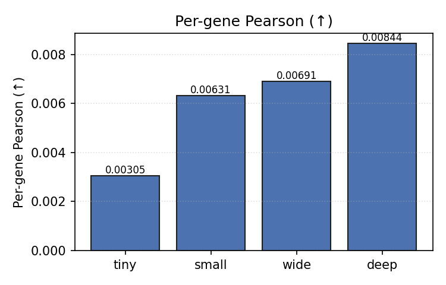
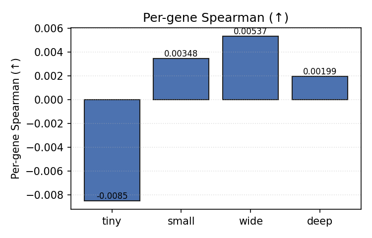
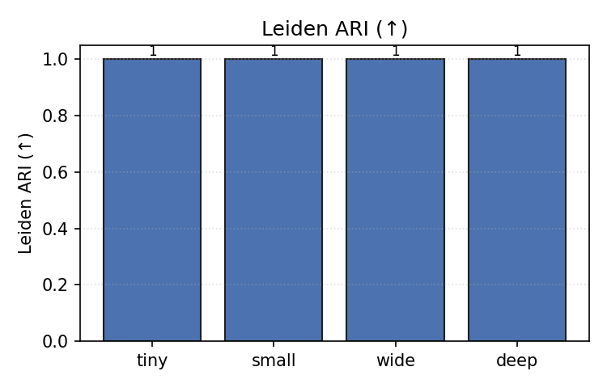
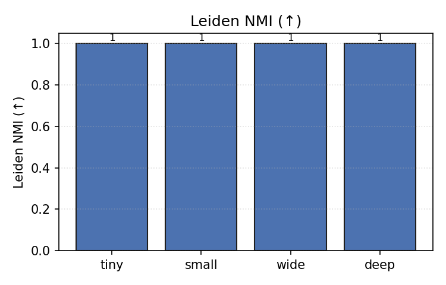
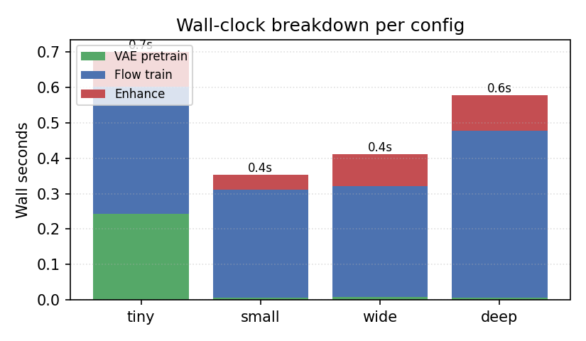
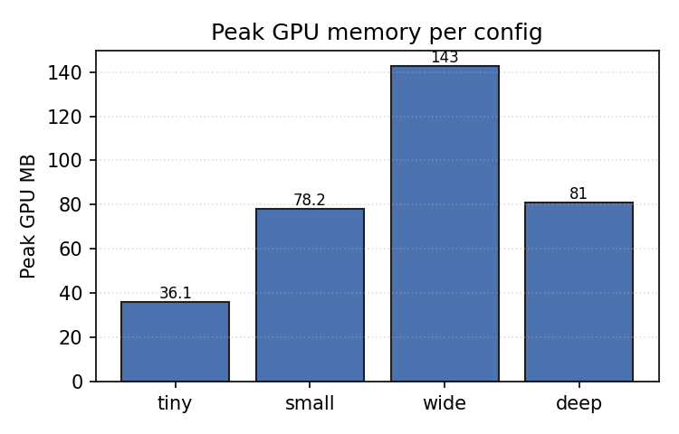
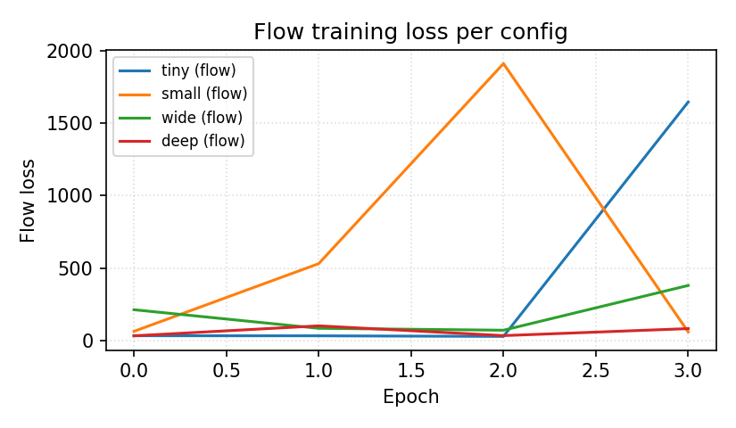
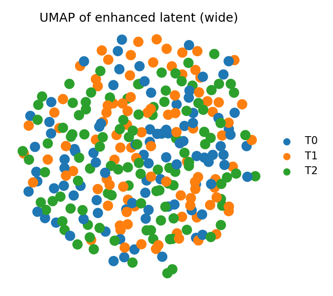

# LuminaST Synthetic Benchmark Report

- Generated: `20260523-060829`
- Device: `cuda`
- Synthetic data: ref 1200 cells × 120 genes, target ST 300 cells, 3 cancer types, seed 42

All runs use the same synthetic dataset and the same random seed; only the model configuration changes.

## Quality metrics per refined version

| Config | latent | hidden | depth | heads | epochs | Pearson | Spearman | ARI | NMI |
|---|---|---|---|---|---|---|---|---|---|
| `tiny` | 16 | 32 | 2 | 2 | 4 | 0.0031 | -0.0085 | 1.0000 | 1.0000 |
| `small` | 32 | 64 | 2 | 2 | 4 | 0.0063 | 0.0035 | 1.0000 | 1.0000 |
| `wide` | 32 | 128 | 2 | 4 | 4 | 0.0069 | 0.0054 | 1.0000 | 1.0000 |
| `deep` | 32 | 64 | 4 | 4 | 4 | 0.0084 | 0.0020 | 1.0000 | 1.0000 |

Per-metric comparison:






## Resource usage per refined version

| Config | Params | Wall total (s) | Flow train (s) | VAE pretrain (s) | Enhance (s) | Peak GPU (MB) |
|---|---|---|---|---|---|---|
| `tiny` | 256,985 | 0.70 | 0.36 | 0.24 | 0.10 | 36.1 |
| `small` | 403,257 | 0.35 | 0.31 | 0.01 | 0.04 | 78.2 |
| `wide` | 915,897 | 0.41 | 0.31 | 0.01 | 0.09 | 142.5 |
| `deep` | 552,633 | 0.58 | 0.47 | 0.01 | 0.10 | 81.0 |





## Training loss curves



## Enhanced-latent UMAP (largest config)



---

Raw per-config JSON (loss curves, enhanced AnnData paths) lives under `results/benchmark/` (git-ignored). Re-run with:

```bash
conda run --no-capture-output -n dl python scripts/benchmark/run_synthetic_sweep.py
conda run --no-capture-output -n dl python scripts/benchmark/make_plots.py
```
